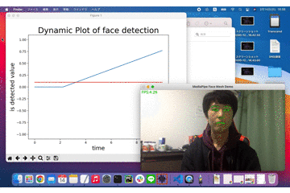

# alert-app-with-face-recognition-using-mediapipe
## mediapipe-python-sample
* [Github](https://github.com/Kazuhito00/mediapipe-python-sample)<br>
* [ブログ](https://qiita.com/Kazuhito/items/222999f134b3b27418cd)
↑を元に作成しました。Mediapipeの[Hands, Pose, Face Mesh, Holistic]のサンプルアプリを公開してくれています。

## alert-app-with-face-recognition-using-mediapipe



# Requirement 
* mediapipe 0.8.1 or later
* OpenCV 3.4.2 or later
* plyer #notification
* matplotlib #graph

mediapipeはpipでインストールできます。
plyerはpython3.9ではインストールできませんでした。(2021/02/14時点)
python3.7 or 3.8でインストール出来ることを確認しています。
```bash
pip install mediapipe
pip install plyer
pip install matplotlib
```

# Demo
デモの実行方法は以下です。
```bash
python alert_with_mediapipe_face.py
```
デモ実行時には、以下のオプションが指定可能です。

* --device<br>
カメラデバイス番号の指定<br>
デフォルト：0
* --width<br>
カメラキャプチャ時の横幅<br>
デフォルト：960
* --height<br>
カメラキャプチャ時の縦幅<br>
デフォルト：540
* --min_detection_confidence<br>
検出信頼値の閾値<br>
デフォルト：0.5(sample_hand.pyのみ0.7)
* --min_tracking_confidence<br>
トラッキング信頼値の閾値<br>
デフォルト：0.5
* --use_brect<br>
外接矩形を描画するか否か<br>
デフォルト：指定なし

# Reference
* [MediaPipe](https://github.com/google/mediapipe)
* [mediapipe-python-sample](https://github.com/Kazuhito00/mediapipe-python-sample)

# Author
https://twitter.com/hiro8772
 
# License 
mediapipe-python-sample is under [Apache-2.0 License](LICENSE).
